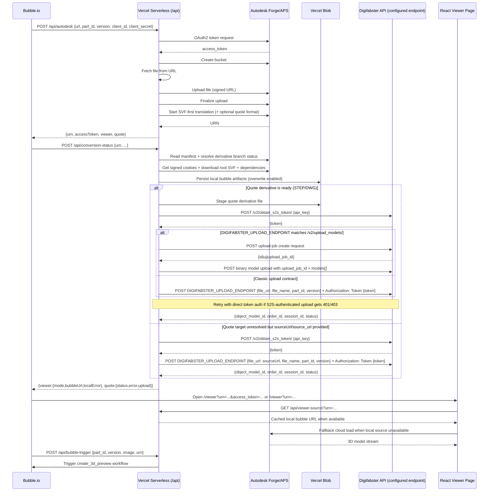

<!-- last-verified: 2026-04-09 -->

# Codebase Guide — Entag 3D Viewer

## Overview

A Vite + React + TypeScript app that bridges Bubble.io with Autodesk Forge/APS for 3D viewing and quote-derivative handling. The app is designed to be embedded in an iframe inside a Bubble.io page.

## System Flow

## Component Boundaries

| Component | Responsibility | Tech |
|---|---|---|
| **Vercel Serverless API** (`api/`) | Autodesk auth/upload/translation, conversion polling, local bubble persistence, quote upload sync, Bubble.io webhook | Node.js, Fetch API, Axios |
| **React SPA** (`src/`) | Viewer page with cloud mode, direct local mode, and URN-only local-resolution mode | React 18, React Router 7 |
| **Autodesk CDN** (external) | Forge Viewer JS/CSS loaded in `index.html` | `viewer3D.min.js` v7.* |
| **Vercel Blob** (external) | Stores cached viewer derivatives, URN mapping, staged quote files, and quote upload sync records | `@vercel/blob` |
| **Digifabster API** (external) | Receives staged quote derivative URLs and part metadata | HTTPS JSON API |
| **Bubble.io** (external) | Upstream app — sends upload requests, receives URN/token, embeds viewer iframe | Bubble API |

## Key Design Decisions

1. **Credentials passed per-request** — Autodesk `client_id`/`client_secret` are sent in each POST body from Bubble, not stored as env vars. This allows multi-tenant usage with different Autodesk accounts.
2. **Iframe embedding** — Vite config sets permissive `X-Frame-Options: ALLOWALL` and `Content-Security-Policy: frame-ancestors 'self' *` to allow embedding from any domain.
3. **SVF-first conversion with fallback lookup** — New conversions target SVF first for local artifact completeness; manifest polling still falls back to SVF2 when resolving existing derivatives.
4. **Transient buckets** — Each upload creates a new bucket with `policyKey: "transient"` (auto-deleted after 24h). Bucket key is `Date.now()`.
5. **No auth middleware** — API endpoints have no authentication layer; security relies on the Bubble.io integration passing valid Autodesk credentials.
6. **Blob-backed local viewer cache** — On viewer-ready status, API downloads root `.svf`, parses internal manifest for dependency URIs, uploads all assets under output-relative paths, and stores URN → bubble URL mapping for URN-only startup.
7. **Signed cookie normalization** — Derivative download cookies are merged from Autodesk payload plus `Set-Cookie` headers to support CloudFront-protected downloads reliably.
8. **Viewer-first contract** — Viewer conversion status and quote status are tracked independently so 3D viewing is not blocked by downstream quote processing.
9. **Fail-fast quote upload sync** — When quote derivative syncing fails, `/api/conversion-status` returns structured error metadata (`error`, `code`, `details`) instead of silently degrading.
10. **Explicit Digifabster endpoint config** — Upload and price-tweak forwarding require `DIGIFABSTER_UPLOAD_ENDPOINT` / `DIGIFABSTER_PRICE_TWEAK_ENDPOINT`; no implicit bridge-host fallback is used.
11. **DigiFabster S2S auth flow** — Outbound DigiFabster calls exchange `DIGIFABSTER_API_KEY` (fallback `DIGIFABSTER_API_TOKEN`) at `DIGIFABSTER_TOKEN_EXCHANGE_ENDPOINT` (`/v2/obtain_s2s_token/` default) and reuse the returned token in shared `Authorization: Token ...` headers.
12. **Upload-contract compatibility** — DigiFabster upload handling supports both classic `file_url` submissions and `/v2/upload_models/` compatibility mode, where the helper first creates an upload job and then performs a multipart binary model upload; upload requests do not force JSON content type.
13. **Auth fallback for upload calls** — If a DigiFabster upload request returns `401` or `403` after S2S auth, the helper can retry with direct token auth unless explicitly disabled.
14. **Native-source sync fallback** — If quote target cannot be resolved from Autodesk manifest, `/api/conversion-status` can sync the original source file directly to DigiFabster using `source_url`/`sourceUrl` and optional `source_file_name`/`sourceFileName`.
15. **Best-effort sync-record persistence** — Blob-backed sync records are helpful for deduping and replay protection, but record-write failures should not turn a completed DigiFabster submission into an API failure.
